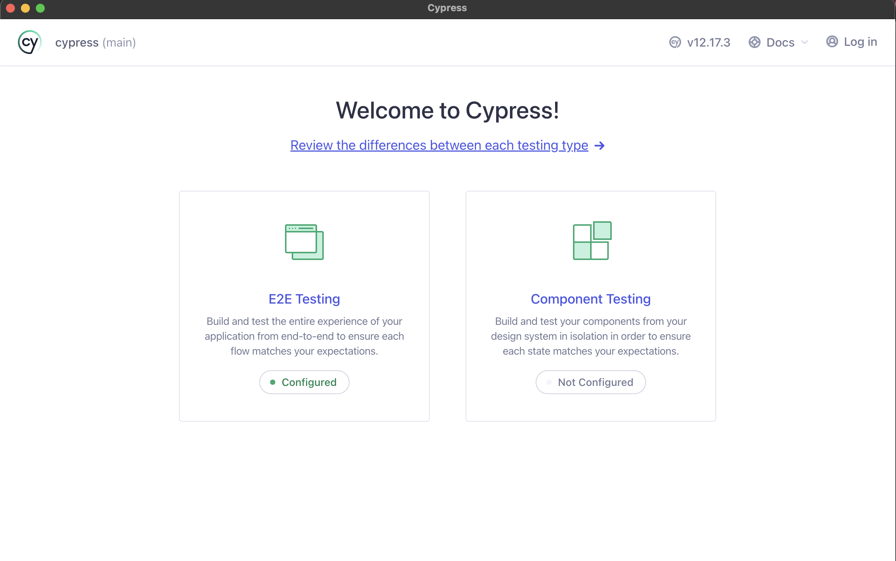
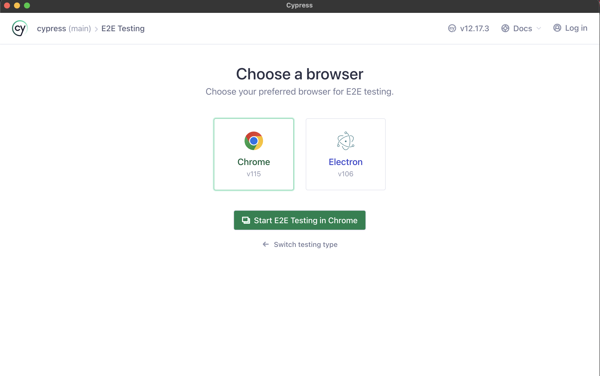
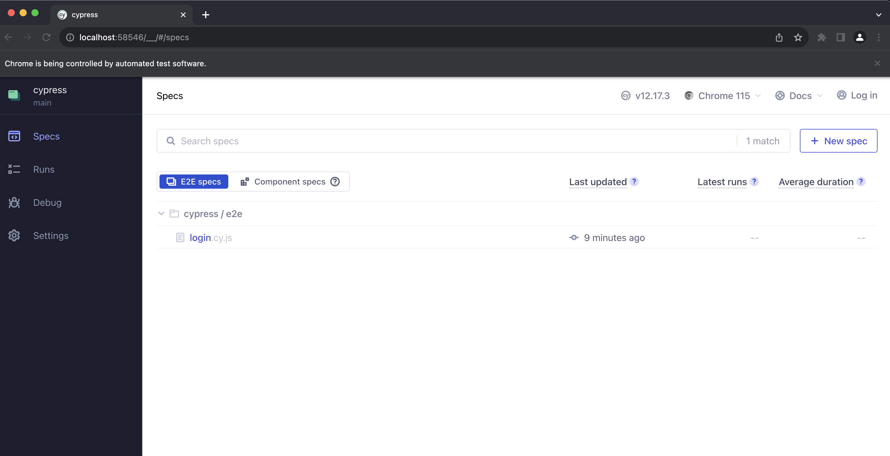

## Cypress setup
- Clone repo : `git clone https://github.com/nabin-bh/cypress.git`
- Go to cypress project : `cd cypress`
- Install dependencies: `npm install`
- Step 4: Open Cypress : `npx cypress open`
- you can see this page:
 
- now click `E2E Testing`
- you will see 

- and then choose browser, for now we are good to go with chrome so click `chrome` and click `Start E2E Testing in Chrome` button
- you will see following cypress dashboard
 

# Now we can run all of our cypress test from this dashboard 
lets go through `login.cy.js`, click this file 